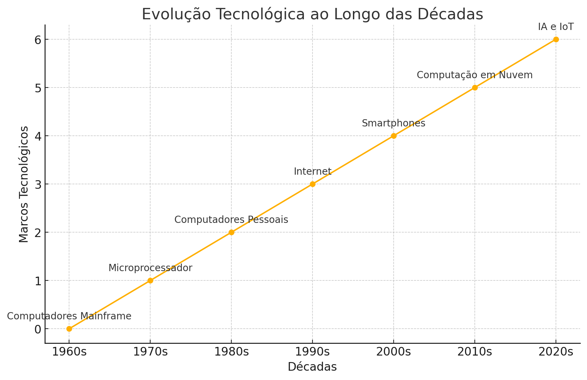

#  Relatório sobre a Evolução Tecnológica :computer:

## Introdução

A evolução tecnológica ao longo das décadas tem sido marcada por inovações significativas que transformaram a maneira como vivemos e trabalhamos. Este relatório acompanha alguns dos principais marcos tecnológicos desde a década de 1960 até os dias atuais.

### Décadas e Marcos Tecnológicos
* 1960s: Computadores Mainframe

Os computadores mainframe foram introduzidos e utilizados principalmente por grandes empresas e governos. Eles eram enormes, caros e exigiam ambientes especiais para operação.

* 1970s: Microprocessador

A introdução do microprocessador revolucionou a computação, permitindo a miniaturização dos componentes e abrindo caminho para a criação de computadores pessoais.

* 1980s: Computadores Pessoais

Os computadores pessoais (PCs) se tornaram acessíveis ao público em geral, mudando drasticamente o cenário da computação. Empresas como Apple e IBM lideraram essa revolução.

* 1990s: Internet

A internet se tornou comercialmente disponível e rapidamente transformou a comunicação, a informação e o comércio. O advento da World Wide Web tornou a internet acessível a um público ainda maior.

* 2000s: Smartphones

A introdução dos smartphones combinou a funcionalidade dos telefones celulares com a dos computadores pessoais, resultando em dispositivos móveis poderosos que se tornaram onipresentes.

* 2010s: Computação em Nuvem

A computação em nuvem permitiu o armazenamento e processamento de dados em servidores remotos, facilitando o acesso a recursos de computação escaláveis e promovendo a transformação digital das empresas.

* 2020s: Inteligência Artificial (IA) e Internet das Coisas (IoT)

A IA e a IoT estão na vanguarda da tecnologia atual. A IA está sendo integrada em diversos setores para melhorar a automação e a tomada de decisões, enquanto a IoT conecta dispositivos físicos à internet, permitindo a coleta e análise de dados em tempo real.

### Conclusão

A evolução tecnológica continua a avançar rapidamente, impulsionada por inovações que têm impacto profundo na sociedade. Cada década trouxe mudanças que redefiniram o que é possível, e as tendências atuais sugerem que estamos apenas começando a explorar o potencial da tecnologia.

Este gráfico e relatório destacam apenas alguns dos marcos mais significativos, mas a história completa da tecnologia é vasta e multifacetada, refletindo a engenhosidade e a criatividade humanas.